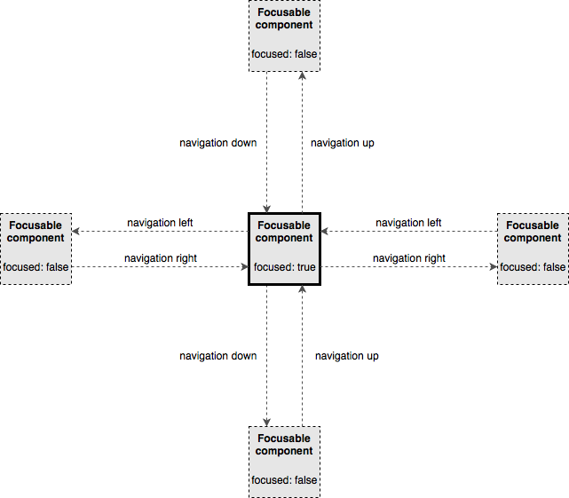

# react-tv-redux-navigation

## The main goal of the project

Predictable and inspectable focus management for [LRUD user input](https://medium.com/netflix-techblog/pass-the-remote-user-input-on-tv-devices-923f6920c9a8).

Instead of traversing through the tree of React components, the completely different approach was applied in this project. 

The core idea is that each focusable component knows about its neighbours, hence has a reference to them. To support the navigation process the system only needs to have a reference to the current focused element, then when the user input is handled get the neighbour reference for the corresponding direction and make this neighbour the next focused element.

## Core layout components

### Focusable component

This component is the foundation of the whole application, as it handles the focus updates and passes them down to target UI components. Focusable component also has references to all neighbour components, e.g. navigationRight, navigationLeft, navigationUp, navigationDown. This component also has a container, which get updates from the Redux store. Navigation reducer is using references from this component in order to maintain the navigation process, e.g. navigating up/down/left/right. If Any of the navigation properties of this component is not defined, it means that there is nothing to be navigated to in the corresponding direction.

### Columns

Columns layout component represents the container with columns, where each columns is a `Focusable` component. To support navigation process, the component should assign left/right navigation references to all columns (`Focusable` elements), so that each of the will know what component is on the left/right side. This component also support scrolling of the content, hence the selected frame stays as the most left one and the lane has a moving effect.

### Rows

Rows layout component is a container with focusable rows inside, where each row is a `Focusable` component. The main principle is very the same, as for Columns component with only difference, that Rows component is assigning up/down neighbours to each Focusable row.

### Scroll

Scroll layout component is a container to support vertical scrolling of Rows component. It always keeps the focused element in the middle of the viewport if possible.

